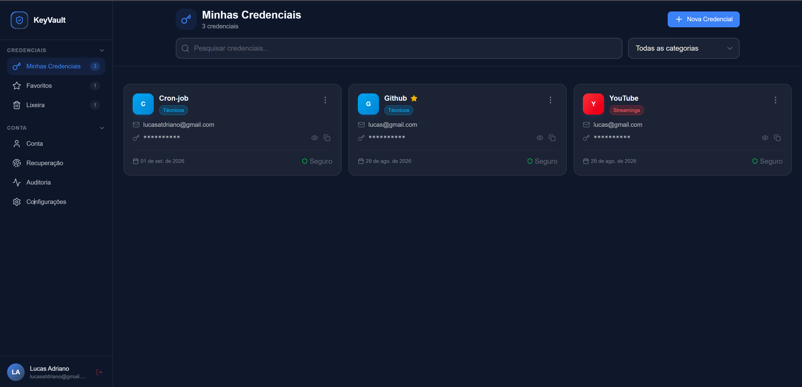

# KeyVault

Gerenciador de senhas com criptografia **zero-knowledge**: toda a criptografia e descriptografia acontece no navegador do usuário, com a chave mestra derivada localmente. O servidor nunca vê a senha mestra nem os dados em texto claro — só armazena blobs criptografados.



## Índice

- [Funcionalidades](#funcionalidades)
- [Como funciona a segurança](#como-funciona-a-segurança-resumo)
- [Stack](#stack)
- [Rodando localmente](#rodando-localmente)
- [Estrutura do projeto](#estrutura-do-projeto)
- [Contato](#contato)

## Funcionalidades

- Cadastro e login com verificação de e-mail
- Cofre de credenciais com categorias, favoritos e lixeira (soft delete)
- Importação e exportação de credenciais
- Criptografia ponta a ponta: cada credencial é cifrada individualmente (AES-256-GCM) antes de sair do cliente
- Recuperação de conta por múltiplos métodos configuráveis: e-mail, perguntas de segurança, senha de recuperação e chave de recuperação
- Log de auditoria por usuário (login, alterações de credencial, mudança de senha mestra, etc.)
- Controle de expiração de sessão configurável
- PWA instalável

## Como funciona a segurança (resumo)

1. No cadastro, o navegador gera uma **chave do cofre** (vault key) aleatória.
2. Essa chave é criptografada com uma chave derivada da senha mestra via **Argon2id**, e só o resultado criptografado (`encryptedVaultKey`) vai para o banco.
3. Para desbloquear o cofre, o cliente deriva a chave novamente a partir da senha mestra digitada e descriptografa a vault key — isso nunca sai do navegador.
4. Cada credencial é criptografada individualmente com **AES-256-GCM**, com IV próprio.
5. A recuperação de conta usa uma chave de dados de recuperação separada, protegida por método (e-mail, perguntas, senha ou chave de recuperação), para reencapsular a vault key sem depender da senha mestra original.

Detalhes de implementação e parâmetros em [`docs/ARCHITECTURE.md`](docs/ARCHITECTURE.md#modelo-de-segurança).

## Stack

**Frontend:** Next.js 16 (App Router), React 19, Tailwind CSS 4, Zustand, React Hook Form + Zod

**Backend:** Server Actions do Next.js, Prisma 7 + PostgreSQL, JWT (jose) para sessão, Resend para e-mails transacionais

**Criptografia:** Web Crypto API (AES-256-GCM), Argon2id (`@node-rs/argon2` / `argon2`)

## Rodando localmente

Pré-requisitos: Node.js, um banco PostgreSQL e uma conta no [Resend](https://resend.com) para envio de e-mail.

```bash
git clone https://github.com/lucasatdriano/KeyVault.git
cd KeyVault
npm install
cp .env.example .env
```

Preencha o `.env` com os dados do seu banco, um `JWT_SECRET`, `INTERNAL_API_SECRET`, `CRON_SECRET` e as credenciais do Resend.

```bash
npx prisma migrate dev
npm run dev
```

Acesse `http://localhost:3000`.

## Estrutura do projeto

```
src/
├── app/        # Rotas do Next.js (App Router) — (auth), (protected), api
├── client/     # Componentes, hooks, store (Zustand), contexts e validadores do lado do cliente
├── server/     # Server actions, services, repositórios, autenticação e validadores
└── shared/     # Criptografia, tipos e validadores usados tanto no client quanto no server
```

## Contato

Desenvolvido por Lucas Adriano.

- **E-mail**: [lucasatdriano@gmail.com](mailto:lucasatdriano@gmail.com)
- **LinkedIn**: [Lucas Adriano](https://linkedin.com/in/lucasadrianodev)
